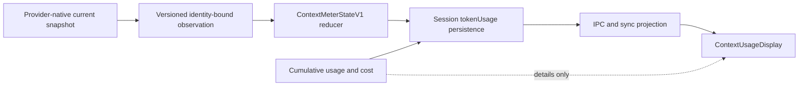

# Context Window Usage Tracking

Nimbalyst's context meter reports current lead-conversation fill. It does not
report cumulative token spend, and cumulative counters are never a fallback for
the meter. The accepted architecture decision is [NIM-577](nimbalyst://NIM-577).

## Truth contract

`ContextMeterStateV1` is the sole persisted and renderer-facing context state.
Only `reduceContextMeterStateV1` may accept a provider observation. Every
observation binds the numerator and denominator evidence to one identity:

- Nimbalyst session, provider, persisted model, provider model, catalog entry,
  selected interface, and upstream thread
- lead producer role (subagent observations are rejected)
- process instance, lifecycle generation, monotonic sequence, and optional turn
- a reviewed telemetry adapter and denominator policy

The reducer accepts safe integer values only, requires exact identity and order,
and never partially merges a numerator with a denominator from another
observation. Fill greater than a runtime window is rejected. Fill greater than
an immutable catalog seed becomes unavailable with `seed-conflict`.

## Confidence classes

| Confidence    | Numerator                            | Denominator                                            | Renderer behavior                                                  |
| ------------- | ------------------------------------ | ------------------------------------------------------ | ------------------------------------------------------------------ |
| `exact`       | current lead runtime observation     | same observation or prior matching runtime observation | numeric fill and percentage                                        |
| `estimated`   | current lead runtime observation     | immutable admitted model seed                          | numeric fill and percentage with an explicit `estimated` qualifier |
| `stale`       | last accepted numeric state          | last accepted denominator                              | last numeric value with an explicit `stale` qualifier              |
| `unavailable` | insufficient or conflicting evidence | none                                                   | `Unavailable`; no percentage or headroom claim                     |

Unavailable reasons are explicit, including missing observations, runtime-window
requirements, malformed evidence, seed conflicts, legacy unverifiable state,
identity invalidation, restart mismatch, and missing terminal observations.

## Cumulative usage is separate

Session `inputTokens`, `outputTokens`, `totalTokens`, cost, and Codex cumulative
baselines remain billing/analytics data. They can appear in the click-open
details panel, labeled as cumulative session totals. They cannot populate
`fillTokens`, `effectiveWindowTokens`, a percentage, or headroom.

This prevents a long session's repeated input snapshots from being presented as
the size of its current prompt.

## Provider observations

### Native Claude, Claude Agent SDK, and admitted proxy routes

For a lead `assistant` step, current fill is:

`input_tokens + cache_read_input_tokens + cache_creation_input_tokens`

`ClaudeCodeTranscriptAdapter` drops usage from chunks carrying
`parent_tool_use_id`, so relayed subagent conversations cannot move the lead
meter. `ClaudeCodeProvider` emits an identity-bound
`claude-agent-sdk-parent-v1` observation for live steps and completion.
Native/base Claude uses a code-bound SDK interface and exact selected model
identity even when no custom catalog route exists. The native CLI proxy emits
the same versioned observation contract from its assembled lead-turn usage;
the legacy `currentContext` mirror is not a renderer input.

At completion, `result.modelUsage` supplies the parent runtime window when
available. For reviewed catalog proxy routes, the selected route is frozen at
initialization and contributes its immutable model seed and interface policy.
Runtime evidence wins; a matching prior runtime window is next; the immutable
seed is used only for `runtime-then-model-seed`. Live overlay changes cannot
alter an active session's frozen route.

Admitted seeds are catalog data, not cross-provider guesses:

- Claudex Sol, Terra, and Luna: 372,000
- DeepSeek Pro routes: 1,000,000
- Flash and other admitted Ollama routes: 128,000

### Codex SDK

`codex-sdk-token-count-v1` pairs the newest current `token_count` snapshot with
its runtime model context window. Provider-cumulative `total_token_usage` is
retained for cumulative accounting only and cannot become current fill.

### Codex app-server

`codex-app-server-thread-usage-v1` accepts only
`thread/tokenUsage/updated` notifications whose thread and turn match the active
lead turn. The numerator comes from `tokenUsage.last.inputTokens`; cumulative
`tokenUsage.total` is isolated from the meter. A positive
`modelContextWindow` is mandatory (`runtime-required`). Null, missing,
malformed, mismatched, or racing notifications fail closed until a complete
matching pair is available.

Both Codex protocols attach their accepted observation to the completion event,
and `OpenAICodexProvider` forwards it unchanged.

## Lifecycle and persistence

`SessionData.tokenUsage.contextMeterState` is persisted and mirrored through
sync. IPC and mobile sync send the entire versioned state, including confidence,
reason, identity, order, and provenance. Mobile metadata is encrypted as one
opaque `ClientMetadata` value; full index sync, incremental cache merge, and
decrypt/apply paths preserve the same state. Legacy cumulative totals are never
reconstructed as mobile current context.

On process hydration, a matching persisted numeric state becomes `stale`.
Legacy `currentContext` pairs are `legacy-unverifiable` and are never promoted.
A fresh exact observation from the new process may replace the stale state only
when identity and lifecycle generation still match.

Compaction, thread reset, model change, route change, and interface change clear
numeric display through a higher lifecycle generation. Late observations from
the prior generation are rejected. A completion without a fresh observation,
cancellation, or error downgrades an available state to `stale`; a state with no
trusted observation remains unavailable.

## Validation boundary

Source-time validation covers reducer precedence and invalidation, malformed
persisted data, live-identity hydration, restart after compaction/unavailable
state for all three adapters, native Claude SDK and CLI producers, Codex paired
fixtures, encrypted mobile metadata round trips, renderer accessibility, and
Packet 1/2 regressions. Runtime and extension-SDK typechecks must remain green;
Electron compilation may report only independently frozen baseline debt.

Packaged build/install, desktop relaunch, live provider calls, credentials,
two-device mobile smoke, and restart/resume/compaction UI smoke are build-time
validation. They are not claimed by source tests and remain required before
release.

## Data flow

## Implementation map

| File                                                                          | Responsibility                                          |
| ----------------------------------------------------------------------------- | ------------------------------------------------------- |
| `packages/runtime/src/ai/contextMeter.ts`                                     | closed domain types, validation, hydration, and reducer |
| `packages/runtime/src/ai/server/providers/claudeCode/providerCatalog.ts`      | validated immutable seed and telemetry policy schema    |
| `packages/runtime/src/ai/server/providers/ClaudeCodeProvider.ts`              | lead-only Claude observations and lifecycle generation  |
| `packages/runtime/src/ai/server/protocols/CodexSDKProtocol.ts`                | paired Codex SDK observations                           |
| `packages/runtime/src/ai/server/protocols/CodexAppServerProtocol.ts`          | matching app-server thread/turn observations            |
| `packages/electron/src/main/services/ai/MessageStreamingHandler.ts`           | reducer integration, persistence, IPC, and sync         |
| `packages/electron/src/main/services/ai/claudeCliContextUsage.ts`             | native CLI versioned observations                       |
| `packages/runtime/src/sync/CollabV3Sync.ts`                                   | encrypted mobile/index state round trip                 |
| `packages/electron/src/renderer/components/UnifiedAI/ContextUsageDisplay.tsx` | confidence-aware, fail-closed display                   |
