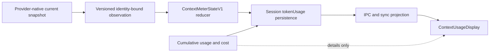

# Context Window Usage Tracking

Nimbalyst's context meter reports current lead-conversation fill. It does not
report cumulative token spend, and cumulative counters are never a fallback for
the meter. The accepted architecture decision is [NIM-577](nimbalyst://NIM-577).

## Truth contract

`ContextMeterStateV1` is the sole persisted and renderer-facing context state.
Only `reduceContextMeterStateV1` may accept a provider observation. Every
observation binds the numerator and denominator evidence to one identity:

- Nimbalyst session, provider, persisted model, provider model, catalog entry,
  selected interface, and upstream thread
- lead producer role (subagent observations are rejected)
- process instance, lifecycle generation, monotonic sequence, and optional turn
- a reviewed telemetry adapter and denominator policy

The reducer accepts safe integer values only, requires exact identity and order,
and never partially merges a numerator with a denominator from another
observation. Fill greater than a runtime window is rejected. Fill greater than
an immutable catalog seed becomes unavailable with `seed-conflict`.

## Confidence classes

| Confidence    | Numerator                            | Denominator                                            | Renderer behavior                                                  |
| ------------- | ------------------------------------ | ------------------------------------------------------ | ------------------------------------------------------------------ |
| `exact`       | current lead runtime observation     | same observation or prior matching runtime observation | numeric fill and percentage                                        |
| `estimated`   | current lead runtime observation     | immutable admitted model seed                          | numeric fill and percentage with an explicit `estimated` qualifier |
| `stale`       | last accepted numeric state          | last accepted denominator                              | last numeric value with an explicit `stale` qualifier              |
| `unavailable` | insufficient or conflicting evidence | none                                                   | `Unavailable`; no percentage or headroom claim                     |

Unavailable reasons are explicit, including missing observations, runtime-window
requirements, malformed evidence, seed conflicts, legacy unverifiable state,
identity invalidation, restart mismatch, and missing terminal observations.

## Cumulative usage is separate

Session `inputTokens`, `outputTokens`, `totalTokens`, cost, and Codex cumulative
baselines remain billing/analytics data. They can appear in the click-open
details panel, labeled as cumulative session totals. They cannot populate
`fillTokens`, `effectiveWindowTokens`, a percentage, or headroom.

This prevents a long session's repeated input snapshots from being presented as
the size of its current prompt.

## Provider observations

### Native Claude, Claude Agent SDK, and admitted proxy routes

For a lead `assistant` step, current fill is:

`input_tokens + cache_read_input_tokens + cache_creation_input_tokens`

`ClaudeCodeTranscriptAdapter` drops usage from chunks carrying
`parent_tool_use_id`, so relayed subagent conversations cannot move the lead
meter. `ClaudeCodeProvider` emits an identity-bound
`claude-agent-sdk-parent-v1` observation for live steps and completion.
Native/base Claude uses a code-bound SDK interface and exact selected model
identity even when no custom catalog route exists. The native CLI proxy emits
the same versioned observation contract from its assembled lead-turn usage;
the legacy `currentContext` mirror is not a renderer input.

At completion, `result.modelUsage` supplies the parent runtime window when
available. For reviewed catalog proxy routes, the selected route is frozen at
initialization and contributes its immutable model seed and interface policy.
Runtime evidence wins; a matching prior runtime window is next; the immutable
seed is used only for `runtime-then-model-seed`. Live overlay changes cannot
alter an active session's frozen route.

Admitted seeds are catalog data, not cross-provider guesses:

- Claudex Sol, Terra, and Luna: 372,000
- DeepSeek Pro routes: 1,000,000
- Flash and other admitted Ollama routes: 128,000

### Codex SDK

`codex-sdk-token-count-v1` pairs the newest current `token_count` snapshot with
its runtime model context window. Provider-cumulative `total_token_usage` is
retained for cumulative accounting only and cannot become current fill.

### Codex app-server

`codex-app-server-thread-usage-v1` accepts only
`thread/tokenUsage/updated` notifications whose thread and turn match the active
lead turn. The numerator comes from `tokenUsage.last.inputTokens`; cumulative
`tokenUsage.total` is isolated from the meter. A positive
`modelContextWindow` is mandatory (`runtime-required`). Null, missing,
malformed, mismatched, or racing notifications fail closed until a complete
matching pair is available.

Both Codex protocols attach their accepted observation to the completion event,
and `OpenAICodexProvider` forwards it unchanged.

## Lifecycle and persistence

`SessionData.tokenUsage.contextMeterState` is persisted and mirrored through
sync. IPC and mobile sync send the entire versioned state, including confidence,
reason, identity, order, and provenance. Mobile metadata is encrypted as one
opaque `ClientMetadata` value; full index sync, incremental cache merge, and
decrypt/apply paths preserve the same state. Legacy cumulative totals are never
reconstructed as mobile current context.

On process hydration, a matching persisted numeric state becomes `stale`.
Legacy `currentContext` pairs are `legacy-unverifiable` and are never promoted.
A fresh exact observation from the new process may replace the stale state only
when identity and lifecycle generation still match.

Compaction, thread reset, model change, route change, and interface change clear
numeric display through a higher lifecycle generation. Late observations from
the prior generation are rejected. A completion without a fresh observation,
cancellation, or error downgrades an available state to `stale`; a state with no
trusted observation remains unavailable.

## Validation boundary

Source-time validation covers reducer precedence and invalidation, malformed
persisted data, live-identity hydration, restart after compaction/unavailable
state for all three adapters, native Claude SDK and CLI producers, Codex paired
fixtures, encrypted mobile metadata round trips, renderer accessibility, and
Packet 1/2 regressions. Runtime and extension-SDK typechecks must remain green;
Electron compilation may report only independently frozen baseline debt.

Packaged build/install, desktop relaunch, live provider calls, credentials,
two-device mobile smoke, and restart/resume/compaction UI smoke are build-time
validation. They are not claimed by source tests and remain required before
release.

## Data flow



## Implementation map

| File                                                                          | Responsibility                                          |
| ----------------------------------------------------------------------------- | ------------------------------------------------------- |
| `packages/runtime/src/ai/contextMeter.ts`                                     | closed domain types, validation, hydration, and reducer |
| `packages/runtime/src/ai/server/providers/claudeCode/providerCatalog.ts`      | validated immutable seed and telemetry policy schema    |
| `packages/runtime/src/ai/server/providers/ClaudeCodeProvider.ts`              | lead-only Claude observations and lifecycle generation  |
| `packages/runtime/src/ai/server/protocols/CodexSDKProtocol.ts`                | paired Codex SDK observations                           |
| `packages/runtime/src/ai/server/protocols/CodexAppServerProtocol.ts`          | matching app-server thread/turn observations            |
| `packages/electron/src/main/services/ai/MessageStreamingHandler.ts`           | reducer integration, persistence, IPC, and sync         |
| `packages/electron/src/main/services/ai/claudeCliContextUsage.ts`             | native CLI versioned observations                       |
| `packages/runtime/src/sync/CollabV3Sync.ts`                                   | encrypted mobile/index state round trip                 |
| `packages/electron/src/renderer/components/UnifiedAI/ContextUsageDisplay.tsx` | confidence-aware, fail-closed display                   |

The SDK also provides `contextWindow` (e.g., 200,000) per model in `result.modelUsage`.

## Cumulative vs Per-Step Usage

The SDK has two kinds of usage data that look similar but mean very different things:

| Field | Scope | Use for |
|---|---|---|
| `chunk.message.usage` (on `assistant` chunks) | **Per-step** | Context fill display |
| `result.usage` (on `result` chunk) | **Cumulative** across all steps | Not useful (zeroed out) |
| `result.modelUsage` (on `result` chunk) | **Cumulative** across all steps | Billing, cost tracking, `contextWindow` |

This distinction is critical. A session with 200k context might show `modelUsage.inputTokens = 3,100,000` because it sums every step's input across the entire session. Using that for context fill would be wildly wrong.

We track these separately in `ClaudeCodeProvider.ts`:
- **`usageData`** -- general usage tracking, gets overwritten by cumulative `result.usage` at the end of a turn
- **`lastAssistantUsage`** -- only set from `assistant` chunks, never overwritten by the result chunk. This is what we use for context fill.

## Live (Mid-Turn) Updates

Context fill is surfaced **per assistant step**, not just at turn end. Every `assistant` chunk carries per-step `usage`; the provider emits a lightweight `context_usage` StreamChunk (carrying `contextFillTokens` only) for each one, and `MessageStreamingHandler` updates **only** `currentContext` from it and fires `ai:tokenUsageUpdated`. Cumulative input/output counters stay on the `complete` chunk so the live updates can't double-count. Without this, a long agentic turn (many tool calls over minutes) shows no indicator movement until the final `result` chunk. See NIM-868.

References:
- [Claude Agent SDK cost tracking docs](https://platform.claude.com/docs/en/agent-sdk/cost-tracking)
- [GitHub issue #66](https://github.com/anthropics/claude-agent-sdk-typescript/issues/66) on cumulative vs per-step usage

## Compaction Handling

When a user runs `/compact`, the SDK produces this chunk sequence:

```
system(status: "compacting")
system(status: null)
system(init)
system(compact_boundary)    ← has compact_metadata.pre_tokens
user(compaction summary)
result
```

There is **no `assistant` message** after compaction. Without special handling, `lastAssistantUsage` would still hold the pre-compaction value (e.g., 94% full), which is now stale since the context was just compressed.

Fix: when we see `compact_boundary`, we:
1. Reset `lastAssistantUsage = undefined` so the stale value isn't used
2. Set `contextCompacted = true` on the `complete` StreamChunk
3. AIService clears `currentContext` so the UI stops showing stale data

The next real user message will produce a fresh `assistant` response with accurate post-compaction usage.

## Subagents (Task Tool)

Subagents run as **separate SDK conversations** with their own session IDs, but the SDK relays their `assistant` chunks back through the **same** iterator, tagged with `parent_tool_use_id`. A subagent's context is much smaller than the lead's, so if its per-step usage reached the context-fill calc the live indicator would bounce between the lead's large context and the subagent's small one (NIM-868).

`ClaudeCodeTranscriptAdapter` therefore **skips per-step `usage` items when `parent_tool_use_id` is set** -- the same guard the `session_id` capture uses. Only the parent session's assistant messages set `lastAssistantUsage` / emit `context_usage`, so subagent usage never contaminates the parent's context fill.

After a subagent completes, its tool_result is added to the parent's conversation. The parent's next `assistant` message correctly reflects the enlarged context (including the subagent result).

## The 1M Context Window (and why the CLI path differs)

The 1M-token window is **plan-gated**, not a model property ([model config docs](https://code.claude.com/docs/en/model-config), "Extended context"): Max/Team/Enterprise get Opus auto-upgraded to 1M with no configuration, Pro pays usage credits for it, API/pay-as-you-go has full access, and `CLAUDE_CODE_DISABLE_1M_CONTEXT=1` removes 1M entirely. Sonnet 5 on the Anthropic API always runs 1M — it has no 200K variant and no `[1m]` suffix to select, which is why there is no `sonnet-1m` picker row.

So the per-variant table in `modelConstants.ts` is a **seed**, and each provider path corrects it differently:

| Path | Live signal | Correction |
|---|---|---|
| `claude-code` (Agent SDK — most users) | `result.modelUsage[<id>].contextWindow` | Self-corrects after the first turn (`resolveClaudeCodeParentContextWindow`) |
| `claude-code-cli` (genuine CLI) | `anthropic-beta: context-1m-2025-08-07` on the outbound `/v1/messages`, read by the observation proxy | `noteClaudeCliObserved1mSupport` → `contextWindowForCliModel`; keyed by model family so a Haiku subagent request can't downgrade the parent |

The CLI path has no runtime `modelUsage` at all (`AssembledUsage` carries no window), so without the header signal the seed would be the permanent denominator.

**Known limitation on the CLI path.** Nimbalyst points the CLI at its loopback observation proxy via `ANTHROPIC_BASE_URL`. Claude Code treats any custom base URL as an LLM gateway whose 1M support it cannot verify, so it **skips the plan-based 1M auto-upgrade** — a Max user whose direct `claude` session runs at 1M gets 200k through Nimbalyst's CLI provider (measured on CLI 2.1.220, GitHub #989). The explicit `[1m]` form is unaffected, so the fix is to select the **Opus 5 (1M)** or **Fable 5 (1M)** row in the model picker, which sends `opus[1m]` / `fable[1m]`. We deliberately do **not** append `[1m]` automatically: it is metered against usage credits on Pro plans, and silently opting a user into paid capacity is exactly the class of change [CLAUDE.md](../CLAUDE.md) forbids. With the header detection above, the meter reports the real window either way.

**The proxy now declares itself first-party, but that does not move the 1M needle.** The CLI is spawned with `_CLAUDE_CODE_ASSUME_FIRST_PARTY_BASE_URL=1` whenever the proxy forwards straight to `api.anthropic.com` (see [`proxyPassthroughEnv.ts`](../packages/electron/src/main/services/ai/claudeCliObservation/proxyPassthroughEnv.ts)), which restores the first-party-only behavior the gateway heuristic was withholding. Measured on CLI 2.1.220: it fixes the web-tool side query (the bug that motivated it), and the explicit `opus[1m]` request still carries `context-1m-2025-08-07`. Plain `opus` still does **not**, so the auto-upgrade above stays unavailable and the `[1m]` picker rows remain the answer.

## Data Flow

```
ClaudeCodeProvider                          AIService
─────────────────                          ─────────
assistant chunk
  → set lastAssistantUsage

compact_boundary
  → reset lastAssistantUsage
  → set receivedCompactBoundary

result chunk
  → compute lastMessageContextTokens
    from lastAssistantUsage
  → yield complete {                       → extract contextFillTokens
      contextFillTokens,                   → extract contextWindow from modelUsage
      contextCompacted,                    → if compacted: clear currentContext
      modelUsage                           → else: set currentContext = {tokens, contextWindow}
    }                                      → persist to DB + send IPC to UI
```

## Files

| File | Role |
|---|---|
| `packages/runtime/src/ai/server/providers/ClaudeCodeProvider.ts` | Streaming loop, `lastAssistantUsage` tracking, compaction reset |
| `packages/electron/src/main/services/ai/AIService.ts` | Persists `tokenUsage.currentContext`, sends `ai:tokenUsageUpdated` IPC |
| `packages/runtime/src/ai/server/types.ts` | `contextFillTokens` and `contextCompacted` fields on `StreamChunk` |
| `packages/runtime/src/ai/server/utils/contextUsage.ts` | Legacy `/context` output parser (no longer used for auto-fetch) |
| `packages/runtime/src/ai/modelConstants.ts` | `CLAUDE_CODE_NATIVE_1M_VARIANTS` (seed) and `CLAUDE_CODE_VARIANTS_WITH_1M` (`-1m` picker rows) |
| `packages/electron/src/main/services/ai/claudeCliContextUsage.ts` | CLI-path denominator: observed-1M registry + `contextWindowForCliModel` |
| `packages/electron/src/main/services/ai/claudeCliObservation/claudeApiRequestParser.ts` | `hasContext1mBeta` — reads the outbound `anthropic-beta` flag |
