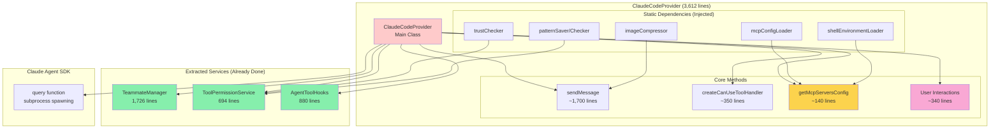
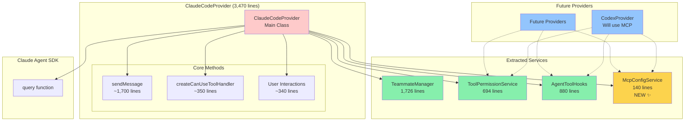
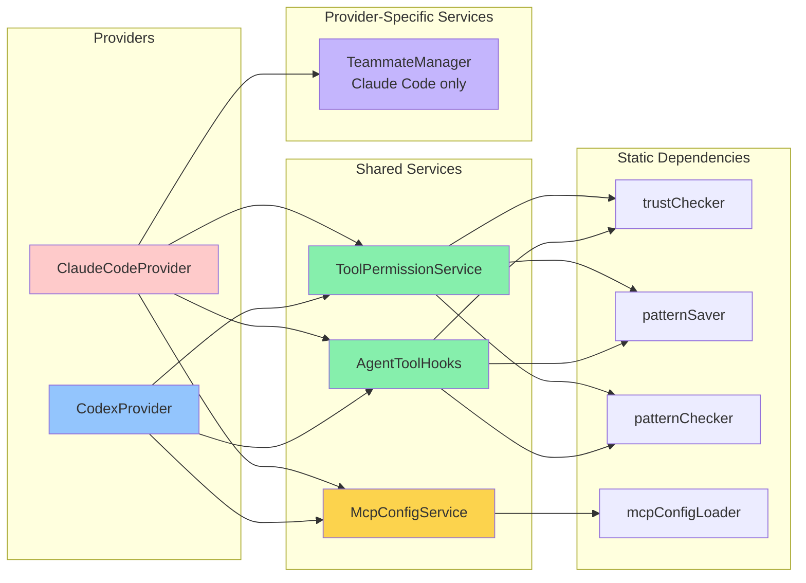
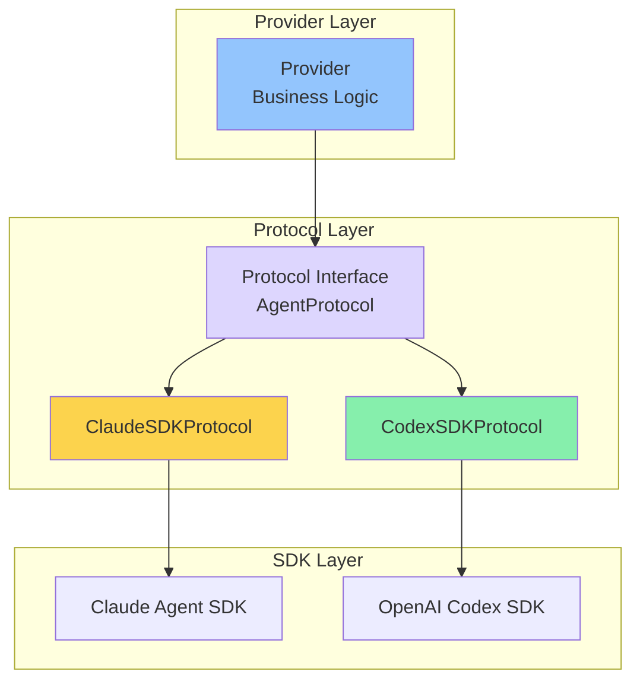

# ClaudeCodeProvider Architecture Diagram

## Current Architecture

## Proposed Architecture (After Phase 1)

## Service Dependency Graph

## Protocol Pattern (CodexProvider Model)

## Comparison: Direct SDK vs Protocol Pattern

### ClaudeCodeProvider (Current - Direct SDK)
- ✅ Full control over SDK features
- ✅ Easy to implement SDK-specific features (interruption, teammates)
- ❌ Tightly coupled to SDK
- ❌ Large provider size (3,612 lines)
- ❌ Hard to test without real SDK

### CodexProvider (Protocol Pattern)
- ✅ Testable with mock protocol
- ✅ Small provider size (607 lines)
- ✅ Clean separation of concerns
- ❌ Protocol layer adds abstraction overhead
- ❌ May not expose all SDK features

## Recommended: Hybrid Approach
- Keep ClaudeCodeProvider with direct SDK access (unique features need it)
- Extract reusable services (MCP config, permissions, hooks)
- CodexProvider can use protocol OR direct SDK based on needs
- Focus on service extraction, not forced protocol abstraction
